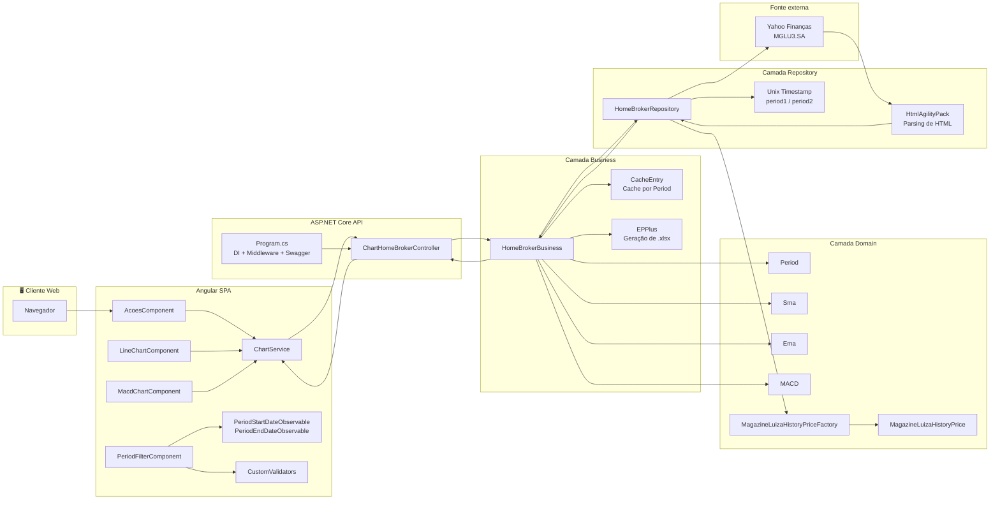
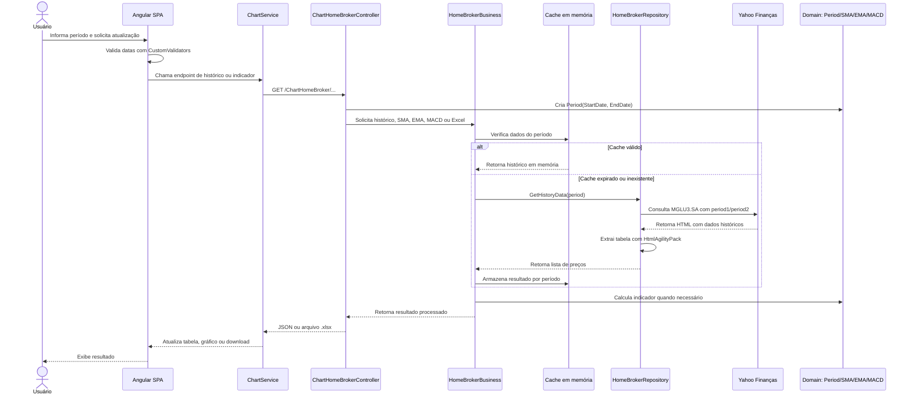

# Home Broker Chart

> Aplicação didática para consulta, visualização e análise técnica de dados históricos da ação **Magazine Luiza S.A. (MGLU3.SA)**, com backend em **ASP.NET Core 8**, frontend em **Angular 17**, gráficos com **ApexCharts**, geração de planilha Excel e testes automatizados.

     

## 📌 Sumário

- [Home Broker Chart](#home-broker-chart)
  - [📌 Sumário](#-sumário)
  - [🧭 Visão geral](#-visão-geral)
  - [🧠 Legenda técnica](#-legenda-técnica)
  - [🎯 Objetivos do projeto](#-objetivos-do-projeto)
  - [🧩 Capacidades funcionais](#-capacidades-funcionais)
  - [🏗️ Arquitetura da solução](#️-arquitetura-da-solução)
    - [Fluxo lógico](#fluxo-lógico)
    - [Camadas principais](#camadas-principais)
  - [🗺️ Diagramas](#️-diagramas)
    - [🏛️ Diagrama de arquitetura](#️-diagrama-de-arquitetura)
    - [🔄 Fluxo operacional da consulta](#-fluxo-operacional-da-consulta)
    - [🧬 Diagrama de classes do backend](#-diagrama-de-classes-do-backend)
  - [📁 Estrutura de pastas](#-estrutura-de-pastas)
  - [📡 Backend ASP.NET Core](#-backend-aspnet-core)
    - [Tecnologias principais](#tecnologias-principais)
    - [Injeção de dependência](#injeção-de-dependência)
    - [Cache](#cache)
  - [🖥️ Frontend Angular](#️-frontend-angular)
    - [Tecnologias principais](#tecnologias-principais-1)
    - [Componentes relevantes](#componentes-relevantes)
  - [🔁 Contratos da API](#-contratos-da-api)
  - [🧮 Indicadores financeiros](#-indicadores-financeiros)
    - [📊 SMA - Média Móvel Simples](#-sma---média-móvel-simples)
    - [📈 EMA - Média Móvel Exponencial](#-ema---média-móvel-exponencial)
    - [📉 MACD - Moving Average Convergence Divergence](#-macd---moving-average-convergence-divergence)
  - [🐳 Docker](#-docker)
    - [Execução com Docker Compose](#execução-com-docker-compose)
  - [🚀 Execução local](#-execução-local)
    - [Pré-requisitos](#pré-requisitos)
    - [Backend e SPA pelo Visual Studio](#backend-e-spa-pelo-visual-studio)
    - [Backend pela linha de comando](#backend-pela-linha-de-comando)
    - [Frontend Angular isolado](#frontend-angular-isolado)
  - [🧪 Testes e cobertura](#-testes-e-cobertura)
    - [Backend](#backend)
    - [Frontend](#frontend)
  - [🔐 Configuração e segurança](#-configuração-e-segurança)
  - [⚠️ Pontos de atenção](#️-pontos-de-atenção)
  - [📄 Licença e uso](#-licença-e-uso)

## 🧭 Visão geral

O **Home Broker Chart** é uma aplicação full stack criada com finalidade acadêmica para demonstrar a construção de uma solução de análise gráfica de ativos financeiros. O sistema coleta dados históricos da ação **MGLU3.SA** a partir do Yahoo Finanças, processa indicadores técnicos no backend e apresenta os resultados em uma interface web responsiva.

A solução é composta por:

- 📡 **Backend ASP.NET Core 8**: API HTTP, Swagger, regras de negócio, cache em memória e geração de arquivo Excel.
- 🧩 **Domínio em C#**: objetos de valor para período, SMA, EMA e MACD.
- 🔌 **Repositório de dados**: integração com Yahoo Finanças usando `HttpClient` e parsing de HTML com `HtmlAgilityPack`.
- 🖥️ **Frontend Angular 17**: SPA com filtros de período, componentes de gráfico, serviços HTTP e validações de formulário.
- 📊 **ApexCharts**: renderização de gráficos de médias móveis e MACD.
- 🧪 **Testes automatizados**: xUnit para backend/domínio e Karma/Jasmine para frontend.
- 🐳 **Docker**: arquivos para execução em ambiente containerizado de desenvolvimento e produção.

> ⚖️ Este projeto possui propósito exclusivamente didático. Ele não representa recomendação de investimento, consultoria financeira ou promessa de retorno. O uso dos dados deve respeitar as leis aplicáveis e os termos das fontes consultadas.

## 🧠 Legenda técnica

| Símbolo | Significado |
| --- | --- |
| 🧭 | Visão de produto, objetivo ou decisão arquitetural. |
| 🧩 | Domínio, regra de negócio, entidade ou objeto de valor. |
| ⚙️ | Serviço de aplicação, orquestração ou processamento. |
| 🔌 | Integração externa, repository, adapter ou contrato. |
| 🌐 | API HTTP, rotas, controllers e transporte. |
| 🖥️ | Frontend, componentes, páginas e experiência do usuário. |
| 📊 | Gráficos, indicadores técnicos e visualização de dados. |
| 🧪 | Testes, cobertura, qualidade e validação. |
| 🐳 | Docker, containers e publicação. |
| ⚠️ | Ponto de atenção, limitação conhecida ou recomendação. |

## 🎯 Objetivos do projeto

- Demonstrar uma aplicação SPA integrada a uma API ASP.NET Core.
- Aplicar separação em camadas com inspiração em **DDD**, **MVC** e **Repository Pattern**.
- Consultar dados históricos de preço da ação **Magazine Luiza S.A. (MGLU3.SA)**.
- Calcular indicadores técnicos como **SMA**, **EMA** e **MACD**.
- Exibir os indicadores em gráficos interativos.
- Permitir download do histórico em formato **Excel**.
- Manter uma base de testes unitários para domínio, negócio, repositório, controller e frontend.
- Facilitar execução local, depuração via Visual Studio 2022 e execução com Docker.

## 🧩 Capacidades funcionais

| Capacidade | Descrição | Camada principal |
| --- | --- | --- |
| Consulta de histórico | Busca preços históricos de abertura, máxima, mínima, fechamento, fechamento ajustado e volume. | Repository |
| Validação de período | Garante intervalo mínimo e impede datas anteriores a `02/05/2011`. | Domain / Frontend |
| Cálculo de SMA | Calcula a Média Móvel Simples com período padrão de 5 dias. | Domain |
| Cálculo de EMA | Calcula a Média Móvel Exponencial para períodos configuráveis, como 9, 12 e 26 dias. | Domain |
| Cálculo de MACD | Calcula linha MACD, linha de sinal e histograma. | Domain |
| Cache em memória | Mantém resultados históricos em cache por 20 minutos e realiza limpeza periódica. | Business |
| Download Excel | Gera planilha `.xlsx` com dados históricos formatados. | Business / API |
| Visualização gráfica | Renderiza médias móveis, histograma, linha MACD e linha de sinal. | Angular |
| Swagger | Expõe documentação interativa da API. | ASP.NET Core |

## 🏗️ Arquitetura da solução

O projeto organiza a aplicação em camadas com responsabilidades bem definidas. A API recebe as requisições, a camada de negócio orquestra cache e cálculos, o domínio encapsula regras financeiras e o repositório realiza a integração externa com a fonte de dados.

```text
Home Broker Chart
├── HomeBrokerSPA/            API ASP.NET Core, Swagger e host da SPA
├── HomeBrokerSPA/HomeBrokerChart/
│   └── src/app/              Frontend Angular, páginas, componentes e services
├── Business/                 Regras de negócio, cache e geração de Excel
├── Domain/                   Entidades, value objects e regras de domínio
├── Repository/               Integração com Yahoo Finanças e parsing dos dados
├── HomeBrokerXUnit/          Testes automatizados do backend e domínio
└── docker-compose*.yml       Orquestração Docker para diferentes ambientes
```

### Fluxo lógico

```text
Angular Component
  -> ChartService
  -> ChartHomeBrokerController
  -> HomeBrokerBusiness
  -> Period / SMA / EMA / MACD
  -> HomeBrokerRepository
  -> Yahoo Finanças
  -> JSON / Excel / Gráfico
```

### Camadas principais

| Camada | Caminho | Responsabilidade |
| --- | --- | --- |
| 🌐 API / Host | `HomeBrokerSPA` | Inicialização ASP.NET Core, DI, Swagger, controllers, arquivos estáticos e fallback da SPA. |
| ⚙️ Business | `Business` | Orquestra consultas, cache, cálculos e geração de planilha Excel. |
| 🧩 Domain | `Domain` | Modela período, preço histórico, SMA, EMA e MACD. |
| 🔌 Repository | `Repository` | Consulta Yahoo Finanças, converte timestamps Unix e extrai dados do HTML. |
| 🖥️ SPA | `HomeBrokerSPA/HomeBrokerChart` | Interface Angular, filtros, validações, gráficos e download. |
| 🧪 Tests | `HomeBrokerXUnit` | Testes de domínio, negócio, repositório e controller. |

## 🗺️ Diagramas

Os diagramas abaixo representam a arquitetura real observada no repositório, destacando a comunicação entre frontend, API, negócio, domínio, repositório e fonte externa de dados.

### 🏛️ Diagrama de arquitetura



### 🔄 Fluxo operacional da consulta



### 🧬 Diagrama de classes do backend

```mermaid
classDiagram
    direction LR

    class ChartHomeBrokerController {
        -IHomeBrokerBusiness _homeBrokerBusiness
        +Get(DateTime StartDate, DateTime EndDate) Task~IActionResult~
        +GetSMA(DateTime StartDate, DateTime EndDate) Task~IActionResult~
        +GetEMA(int PeriodDays, DateTime StartDate, DateTime EndDate) Task~IActionResult~
        +GetMACD(DateTime StartDate, DateTime EndDate) Task~IActionResult~
        +DownloadHistory(DateTime StartDate, DateTime EndDate) Task~IActionResult~
    }

    class IHomeBrokerBusiness {
        <<interface>>
        +GetHistoryData(Period period) Task~List~
        +GetSMA(Period period) Task~Sma~
        +GetEMA(int periodDays, Period period) Task~Ema~
        +GetMACD(Period period) Task~MACD~
        +GenerateExcelHistory(Period period) Task~MemoryStream~
    }

    class HomeBrokerBusiness {
        -IHomeBrokerRepository _homeBrokerRepository
        -IMagazineLuizaHistoryPriceFactory _historyPriceFactory
        -Dictionary _historyCache
        -Timer _cacheCleanupTimer
        +HomeBrokerHistory List
        +GetHistoryData(Period period) Task~List~
        +GetSMA(Period period) Task~Sma~
        +GetEMA(int periodDays, Period period) Task~Ema~
        +GetMACD(Period period) Task~MACD~
        +GenerateExcelHistory(Period period) Task~MemoryStream~
        -DisposeCache(object state) void
    }

    class IHomeBrokerRepository {
        <<interface>>
        +GetHistoryData(Period period) Task~List~
    }

    class HomeBrokerRepository {
        -IMagazineLuizaHistoryPriceFactory _historyPriceFactory
        -ToUnixTimestamp(DateTime date) long
        -DownloadContentAsync(string url) Task~string~
        -ProcessHtmlData(string htmlContent) List
        -ProcessCsvData(string csvContent) List
        +GetHistoryData(Period period) Task~List~
    }

    class IMagazineLuizaHistoryPriceFactory {
        <<interface>>
        +GetHistoryPrice(DateTime date, decimal open, decimal high, decimal low, decimal close, double adjClose, long volume) MagazineLuizaHistoryPrice
    }

    class MagazineLuizaHistoryPriceFactory {
        -Dictionary _cache
        +GetHistoryPrice(DateTime date, decimal open, decimal high, decimal low, decimal close, double adjClose, long volume) MagazineLuizaHistoryPrice
    }

    class Period {
        -DateTime MINIMUM_DATE
        +DateTime StartDate
        +DateTime EndDate
        +int Days
        +Period(DateTime startDate, DateTime endDate)
    }

    class MagazineLuizaHistoryPrice {
        +DateTime Date
        +decimal Open
        +decimal High
        +decimal Low
        +decimal Close
        +double AdjClose
        +long Volume
        +MagazineLuizaHistoryPrice()
        +MagazineLuizaHistoryPrice(DateTime date, decimal open, decimal high, decimal low, decimal close, double adjClose, long volume)
    }

    class Sma {
        +List Values
        +Sma(List historyPriceData, int periodDays)
    }

    class Ema {
        +List Values
        +Ema(List historyPriceData, int periodDays)
    }

    class MACD {
        -int MININUM_AMOUNT_DATA
        -int MACD_LINE_VALUE
        -int EMA12_VALUE
        -int EMA26_VALUE
        +List MACDLine
        +List Signal
        +List Histogram
        +MACD(List historyPrice)
    }

    class CacheEntry {
        +T Data
        +DateTime CreatedAt
        +DateTime ExpirationTime
        +IsExpired() bool
    }

    ChartHomeBrokerController --> IHomeBrokerBusiness
    IHomeBrokerBusiness <|.. HomeBrokerBusiness
    HomeBrokerBusiness --> IHomeBrokerRepository
    HomeBrokerBusiness --> IMagazineLuizaHistoryPriceFactory
    HomeBrokerBusiness --> CacheEntry
    HomeBrokerBusiness --> Period
    HomeBrokerBusiness --> Sma
    HomeBrokerBusiness --> Ema
    HomeBrokerBusiness --> MACD
    HomeBrokerBusiness --> MagazineLuizaHistoryPrice
    IHomeBrokerRepository <|.. HomeBrokerRepository
    HomeBrokerRepository --> Period
    HomeBrokerRepository --> IMagazineLuizaHistoryPriceFactory
    HomeBrokerRepository --> MagazineLuizaHistoryPrice
    IMagazineLuizaHistoryPriceFactory <|.. MagazineLuizaHistoryPriceFactory
    MagazineLuizaHistoryPriceFactory --> MagazineLuizaHistoryPrice
    MACD --> Ema
```



## 📁 Estrutura de pastas

| Caminho | Conteúdo |
| --- | --- |
| `Business/HomeBrokerBusiness.cs` | Serviço de negócio com cache, cálculo de indicadores e geração de Excel. |
| `Business/Cache/CacheEntry.cs` | Estrutura de controle para expiração dos dados em cache. |
| `Domain/Charts/Agreggates` | Modelo de preço histórico da Magazine Luiza. |
| `Domain/Charts/ValueObject` | Objetos de valor `Period`, `Sma`, `Ema` e `MACD`. |
| `Domain/Charts/Agreggates/Factory` | Factory para criação de objetos de preço histórico. |
| `Repository/HomeBrokerRepository.cs` | Repositório responsável por consultar e processar dados externos. |
| `HomeBrokerSPA/Controllers` | Controller HTTP da API de gráficos. |
| `HomeBrokerSPA/HomeBrokerChart/src/app/pages` | Páginas Angular, incluindo a área de ações. |
| `HomeBrokerSPA/HomeBrokerChart/src/app/shared` | Services, interfaces, observables, validators e componentes compartilhados. |
| `HomeBrokerXUnit` | Projeto de testes xUnit. |

## 📡 Backend ASP.NET Core

O backend utiliza **.NET 8** e centraliza as responsabilidades de API, regras de negócio e integração com dados externos.

### Tecnologias principais

| Tecnologia | Uso |
| --- | --- |
| ASP.NET Core 8 | API HTTP, controllers, middleware e host da aplicação. |
| Swashbuckle.AspNetCore | Geração da documentação Swagger/OpenAPI. |
| EPPlus | Geração de planilha Excel com histórico de preços. |
| HtmlAgilityPack | Parsing do HTML retornado pelo Yahoo Finanças. |
| CsvHelper | Suporte a mapeamento de dados tabulares. |
| Newtonsoft.Json | Serialização e manipulação JSON quando necessário. |
| xUnit, Moq, Bogus e Coverlet | Testes automatizados, mocks, massa fake e cobertura. |

### Injeção de dependência

O arquivo `HomeBrokerSPA/Program.cs` registra:

- `IMagazineLuizaHistoryPriceFactory` como singleton.
- `IHomeBrokerRepository` como scoped.
- `IHomeBrokerBusiness` como singleton.
- Controllers, Swagger e arquivos estáticos da SPA.

### Cache

A camada `Business` mantém um cache em memória por `Period`:

- ⏱️ Expiração padrão: **20 minutos**.
- 🔄 Limpeza periódica: **30 minutos**.
- ♻️ Renovação: ao reutilizar uma entrada válida, o tempo de expiração é estendido.

## 🖥️ Frontend Angular

O frontend está em `HomeBrokerSPA/HomeBrokerChart` e foi criado com Angular 17. Ele consome a API por meio do `ChartService`, mantém estado de período por observables compartilhados e renderiza os gráficos com `ng-apexcharts`.

### Tecnologias principais

| Tecnologia | Uso |
| --- | --- |
| Angular 17 | Estrutura da SPA, componentes, módulos, roteamento e forms. |
| TypeScript 5.3 | Tipagem e implementação dos services/componentes. |
| RxJS | Observables e conversão de chamadas HTTP com `lastValueFrom`. |
| ApexCharts / ng-apexcharts | Renderização dos gráficos financeiros. |
| Bootstrap, Bootstrap Icons e MDB UI Kit | Estilos e componentes visuais. |
| Day.js | Formatação e manipulação de datas. |
| Karma e Jasmine | Testes unitários do frontend. |

### Componentes relevantes

| Componente | Responsabilidade |
| --- | --- |
| `AcoesComponent` | Carrega histórico de preços, exibe dados e aciona download de Excel. |
| `PeriodFilterComponent` | Controla o formulário de período e valida o intervalo informado. |
| `LineChartComponent` | Exibe SMA e EMAs em gráfico de área/linha. |
| `MacdChartComponent` | Exibe histograma, linha MACD e linha de sinal. |
| `LoadingComponent` | Componente compartilhado para estados de carregamento. |

## 🔁 Contratos da API

Controller base: `ChartHomeBrokerController`

Rota base: `/ChartHomeBroker`

| Método | Endpoint | Descrição | Retorno esperado |
| --- | --- | --- | --- |
| `GET` | `/ChartHomeBroker/{StartDate}/{EndDate}` | Retorna dados históricos de preço para o período. | `MagazineLuizaHistoryPrice[]` |
| `GET` | `/ChartHomeBroker/GetSMA/{StartDate}/{EndDate}` | Retorna a Média Móvel Simples. | `Sma` |
| `GET` | `/ChartHomeBroker/GetEMA/{PeriodDays}/{StartDate}/{EndDate}` | Retorna a Média Móvel Exponencial para o número de dias informado. | `Ema` |
| `GET` | `/ChartHomeBroker/GetMACD/{StartDate}/{EndDate}` | Retorna linha MACD, sinal e histograma. | `MACD` |
| `GET` | `/ChartHomeBroker/DownloadHistory/{StartDate}/{EndDate}` | Gera e baixa planilha Excel do histórico. | Arquivo `.xlsx` |

Exemplo de período:

```text
GET /ChartHomeBroker/2024-01-01/2024-03-01
```

Modelo principal de resposta:

```json
{
  "date": "2024-01-02T00:00:00",
  "open": 2.12,
  "high": 2.18,
  "low": 2.05,
  "close": 2.10,
  "adjClose": 2.10,
  "volume": 12345678
}
```

## 🧮 Indicadores financeiros

### 📊 SMA - Média Móvel Simples

A **SMA** calcula a média aritmética dos preços de fechamento dentro de uma janela de dias. No projeto, o período padrão é de **5 dias**. Esse indicador ajuda a suavizar oscilações e observar tendências de preço.

### 📈 EMA - Média Móvel Exponencial

A **EMA** atribui maior peso aos preços mais recentes, tornando o indicador mais sensível a mudanças recentes do mercado. O frontend utiliza EMAs de **9**, **12** e **26** dias para compor a visualização técnica.

### 📉 MACD - Moving Average Convergence Divergence

O **MACD** compara médias móveis exponenciais para identificar mudanças de força e direção da tendência:

- Linha MACD: diferença entre EMA de 12 dias e EMA de 26 dias.
- Linha de sinal: EMA de 9 dias aplicada sobre a linha MACD.
- Histograma: diferença entre linha MACD e linha de sinal.

## 🐳 Docker

O projeto contém arquivos Docker para desenvolvimento e produção.

| Arquivo | Finalidade |
| --- | --- |
| `docker-compose.yml` | Compose base para o serviço `homebrokerspa`. |
| `docker-compose.override.yml` | Override de desenvolvimento usado pelo Visual Studio/Docker Compose. |
| `docker-compose.dev.yml` | Ambiente de desenvolvimento com portas `3002` e `3003`. |
| `docker-compose.prod.yml` | Ambiente de produção com portas `3002` e `3003`. |
| `HomeBrokerSPA/Dockerfile.Development` | Build/publish para ambiente de desenvolvimento. |
| `HomeBrokerSPA/Dockerfile.Production` | Build/publish para ambiente de produção. |
| `HomeBrokerSPA/Dockerfile` | Dockerfile padrão do projeto SPA/API. |

### Execução com Docker Compose

```bash
docker compose -f docker-compose.dev.yml up --build
```

Ambiente de produção:

```bash
docker compose -f docker-compose.prod.yml up --build
```

Após a subida, a aplicação deve ficar disponível conforme as portas configuradas no compose:

```text
http://localhost:3002
https://localhost:3003
```

## 🚀 Execução local

### Pré-requisitos

- .NET SDK 8.0
- Node.js compatível com Angular 17
- npm
- Docker Engine, caso deseje executar em container
- Visual Studio 2022, recomendado para depuração integrada

### Backend e SPA pelo Visual Studio

1. Abra a solução `slnHomeBroker.sln`.
2. Defina `HomeBrokerSPA` como projeto inicial.
3. Execute o perfil desejado:

| Perfil | Descrição |
| --- | --- |
| `HomeBrokerSPA` | Executa backend e proxy da SPA Angular. |
| `IIS Express` | Executa via IIS Express. |
| `Docker` | Executa em container com suporte a debug. |
| `Swagger` | Sobe a API em modo Swagger nas portas `5000` e `5001`. |
| `Unit Tests in Watch Mode` | Executa testes backend em modo watch pelo script PowerShell. |

### Backend pela linha de comando

```bash
dotnet restore slnHomeBroker.sln
dotnet build slnHomeBroker.sln
dotnet run --project HomeBrokerSPA/HomeBroker.SPA.csproj
```

Perfil Swagger:

```bash
dotnet run --project HomeBrokerSPA/HomeBroker.SPA.csproj --launch-profile Swagger
```

URLs principais:

```text
https://localhost:7271
http://localhost:5228
https://localhost:5001/swagger
http://localhost:5000/swagger
```

### Frontend Angular isolado

```bash
cd HomeBrokerSPA/HomeBrokerChart
npm install
npm start
```

O script `npm start` usa HTTPS e porta `44437`, conforme configuração do template ASP.NET Core SPA:

```text
https://localhost:44437
```

> ℹ️ Na primeira execução, a instalação das dependências do Angular pode levar alguns minutos.

## 🧪 Testes e cobertura

### Backend

Executar testes xUnit:

```bash
dotnet test ./HomeBrokerXUnit/HomeBroker.XUnit.csproj
```

Executar script PowerShell de cobertura:

```powershell
./generate_coverage_report.ps1
```

Executar testes em modo watch:

```powershell
./dotnet_test_watch_mode.ps1
```

Áreas cobertas por testes:

- `Period`
- `Sma`
- `Ema`
- `MACD`
- `MagazineLuizaHistoryPrice`
- `HomeBrokerBusiness`
- `HomeBrokerRepository`
- `ChartHomeBrokerController`

### Frontend

```bash
cd HomeBrokerSPA/HomeBrokerChart
npm test
```

Executar cobertura em modo headless:

```bash
npm run test:coverage
```

Script PowerShell de cobertura:

```powershell
./generate_coverage_report.ps1
```

Script Linux/macOS:

```bash
./generate_coverage_report.sh
```

## 🔐 Configuração e segurança

- A aplicação usa HTTPS nos perfis locais configurados pelo template ASP.NET Core SPA.
- O backend habilita Swagger para documentação da API.
- O projeto registra `UseHsts()` no pipeline ASP.NET Core.
- O certificado `hb-cert.pfx`, quando presente no ambiente de publicação, é copiado para o output do projeto.
- O Docker Compose de desenvolvimento monta secrets/certificados do ASP.NET em volumes somente leitura.
- A licença do EPPlus é configurada como `NonCommercial`, coerente com o caráter didático do projeto.

## ⚠️ Pontos de atenção

- O projeto depende da estrutura HTML do Yahoo Finanças. Alterações na página podem quebrar o parsing realizado com `HtmlAgilityPack`.
- O endpoint de histórico retorna `NoContent` em caso de exceção genérica; para produção, é recomendável tratar erros com respostas mais específicas.
- O `HomeBrokerSPA/Dockerfile` padrão referencia `COPY --from=build`, mas o estágio declarado no arquivo é `publish`. Os Dockerfiles `Development` e `Production` estão mais alinhados ao fluxo de publish.
- Alguns scripts PowerShell possuem referências antigas; É necessário revisar esses nomes antes de automatizar CI/CD.
- O projeto não deve ser usado como fonte de recomendação financeira. Indicadores técnicos são apenas instrumentos analíticos.

## 📄 Licença e uso

Este projeto está disponível para fins didáticos, estudo e demonstração técnica. Consulte o arquivo `LICENSE` para detalhes formais de licença.

O uso dos dados financeiros deve respeitar os termos da fonte consultada e a legislação aplicável. Nenhuma informação apresentada pela aplicação deve ser interpretada como recomendação de compra, venda ou manutenção de ativos financeiros.
